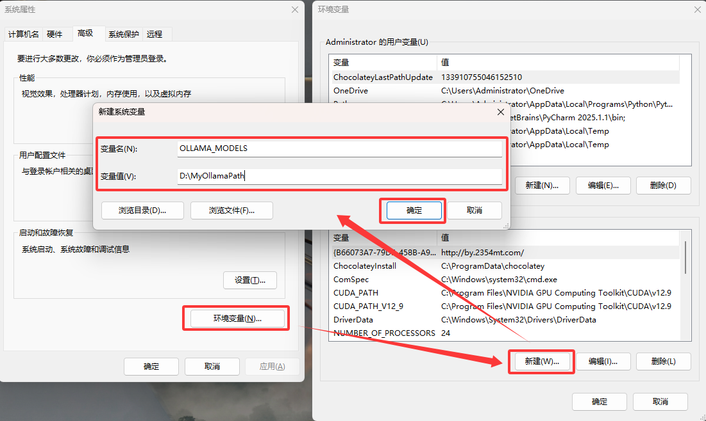
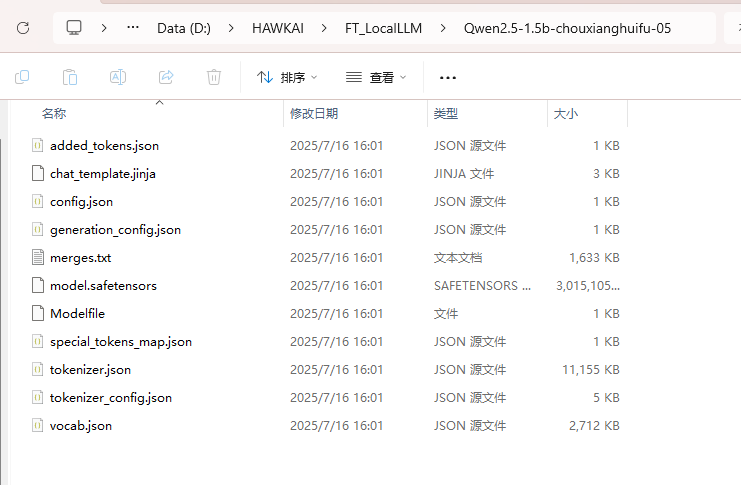
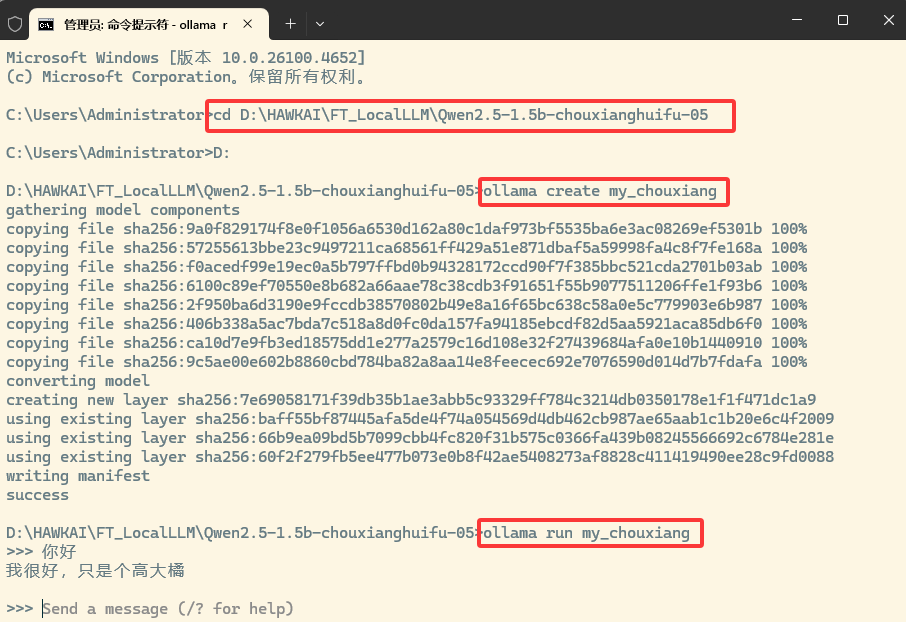

# Ollama 本地运行大模型

## 下载 Ollama 软件

进入 Ollama 官网 [https://ollama.com](https://ollama.com)


点击"Download —— Windows —— Download for Windows" 下载 Ollama.exe

下载完成后直接运行 Ollama.exe 一直点击下一步即可

## 查找模型

点击右上角"Models"查看在Ollama中可用的模型


## 下载并运行模型

以deepseek-r1为例，鼠标左键点击后进入模型详情页，此页面提供当前模型可供下载的版本


找到其中一个当前电脑能够运行的版本，一般情况下：可选参数 ≈ 显存 / 2，我这里是4060 8G，所以就选择deepseek-r1:1.5b。在Ollama上复制此模型ID。


打开CMD运行 Ollama

输入：`Ollama run deepseek-r1:1.5b`

完成命令输入后会自动下载此模型，下载速度取决于网速，耐心等待即可


下载完成后自动运行，如果没有运行起来，则再执行一次：`Ollama run deepseek-r1:1.5b`

模型运行起来之后，就可以进行对话啦~


## 拓展-修改模型路径

Ollama 下载模型的默认路径：`C:\Users\Administrator\.ollama\models`

下面来修改这个模型的路径，打开Windows搜索"环境变量"


点击“环境变量-新建”，在弹出的“新建系统变量”窗口中填入以下信息



## 拓展-注册自定义模型

进入本地磁盘中的模型路径，我这里 D:\HAWKAI\FT_LocalLLM\Qwen2.5-1.5b-chouxianghuifu-05



在CMD中执行以下命令：

直接在此路径下打开CMD，或打开CMD命令，进入此路径
创建模型：ollama create [yourmodelname]
运行模型：ollama run [yourmodelname]



## 拓展-接口调用

根节点：`http://localhost:11434`

1.生成请求（流式）
请求
```json
curl http://localhost:11434/api/generate -d '{
  "model": "llama3.2",
  "prompt": "Why is the sky blue?"
}'
```

响应
```json
{
  "model": "llama3.2",
  "created_at": "2023-08-04T08:52:19.385406455-07:00",
  "response": "The",
  "done": false
}
```

2.列出本地模型
请求
```json
curl http://localhost:11434/api/tags
```

响应
```json
"models": [
    {
      "name": "codellama:13b",
      "modified_at": "2023-11-04T14:56:49.277302595-07:00",
      "size": 7365960935,
      "digest": "9f438cb9cd581fc025612d27f7c1a6669ff83a8bb0ed86c94fcf4c5440555697",
      "details": {
        "format": "gguf",
        "family": "llama",
        "families": null,
        "parameter_size": "13B",
        "quantization_level": "Q4_0"
      }
    }
]
```

3.列出正在运行的模型
请求
```json
curl http://localhost:11434/api/ps
```

响应
```json
{
  "models": [
    {
      "name": "mistral:latest",
      "model": "mistral:latest",
      "size": 5137025024,
      "digest": "2ae6f6dd7a3dd734790bbbf58b8909a606e0e7e97e94b7604e0aa7ae4490e6d8",
      "details": {
        "parent_model": "",
        "format": "gguf",
        "family": "llama",
        "families": [
          "llama"
        ],
        "parameter_size": "7.2B",
        "quantization_level": "Q4_0"
      },
      "expires_at": "2024-06-04T14:38:31.83753-07:00",
      "size_vram": 5137025024
    }
  ]
}
```

4.删除模型
请求
```json
curl -X DELETE http://localhost:11434/api/delete -d '{
    "model": "llama3:13b"
}'
```
响应
如果成功，返回 200 OK；如果要删除的模型不存在，则返回 404 Not Found。

> 💡 **提示**
> Ollama支持多种大模型，包括但不限于DeepSeek、Llama、Mistral等。

> 如果这篇文章对你有帮助，请点个赞支持一下！ ❤️