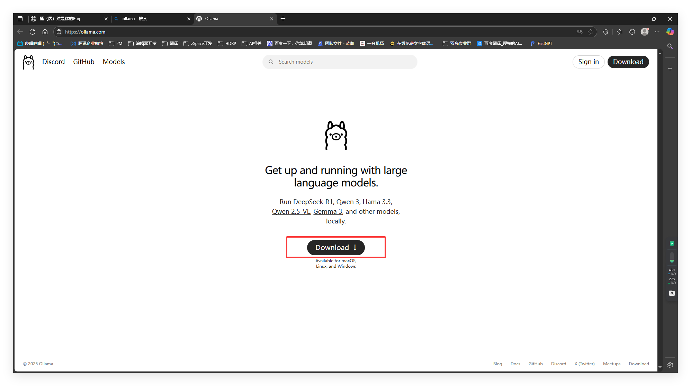
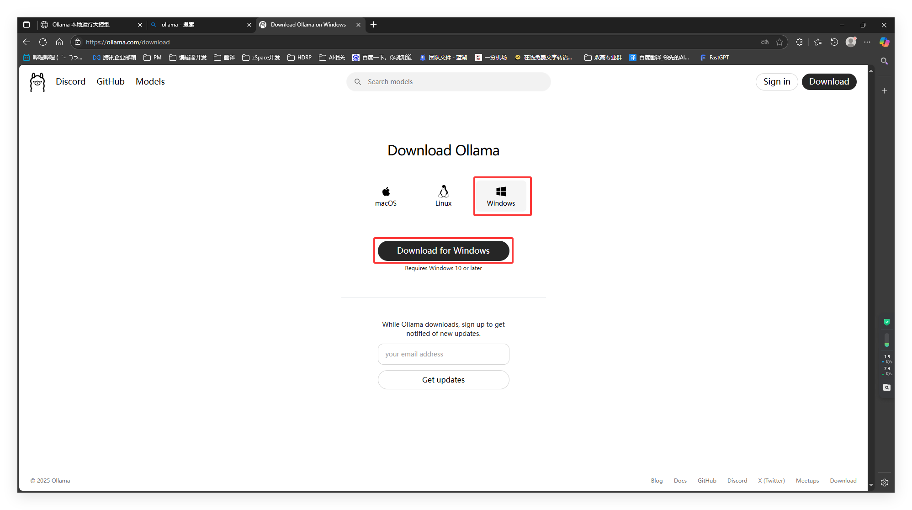
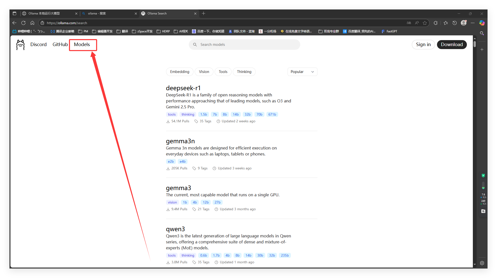
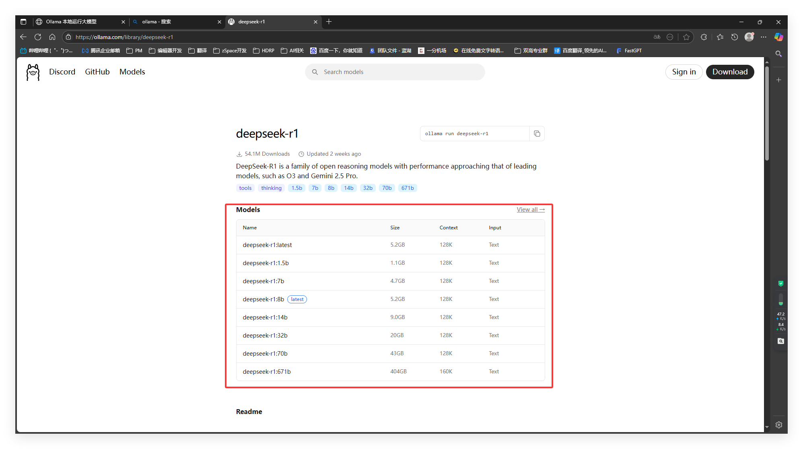
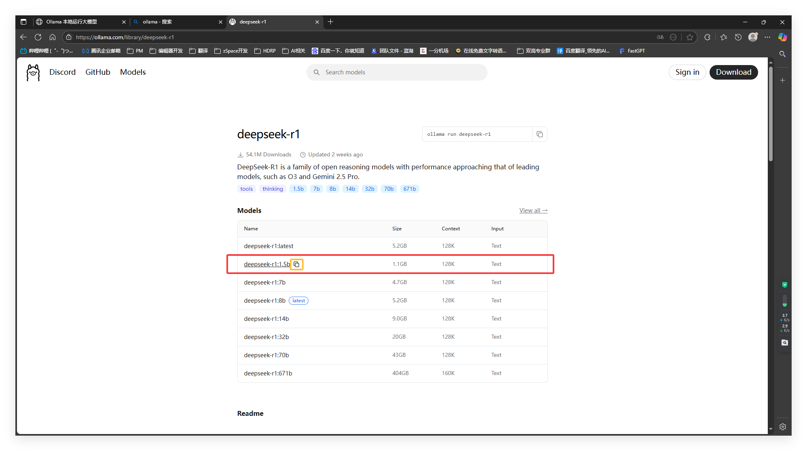
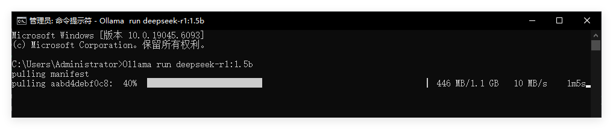
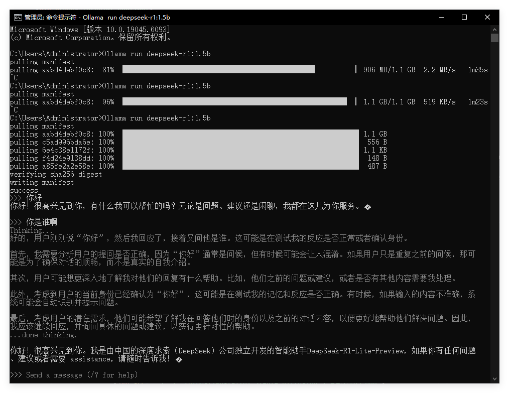
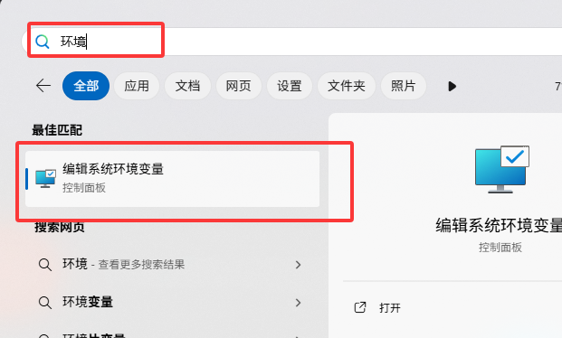

# Ollama 本地运行大模型

## 目录
- [下载 Ollama 软件](#下载-ollama-软件)
- [查找模型](#查找模型)
- [下载并运行模型](#下载并运行模型)
- [拓展-修改模型路径](#拓展-修改模型路径)
- [拓展-注册自定义模型](#拓展-注册自定义模型)
- [拓展-接口调用](#拓展-接口调用)

## 下载 Ollama 软件

进入 Ollama 官网 [https://ollama.com](https://ollama.com)

点击"Download —— Windows —— Download for Windows" 下载 Ollama.exe

下载完成后直接运行 Ollama.exe 一直点击下一步即可

## 查找模型

点击右上角"Models"查看在Ollama中可用的模型

## 下载并运行模型

以deepseek-r1为例，鼠标左键点击后进入模型详情页，此页面提供当前模型可供下载的版本

找到其中一个当前电脑能够运行的版本，一般情况下：可选参数 ≈ 显存 / 2，我这里是4060 8G，所以就选择deepseek-r1:1.5b。在Ollama上复制此模型ID。

打开CMD运行 Ollama

输入：`Ollama run deepseek-r1:1.5b`

完成命令输入后会自动下载此模型，下载速度取决于网速，耐心等待即可

下载完成后自动运行，如果没有运行起来，则再执行一次：`Ollama run deepseek-r1:1.5b`

模型运行起来之后，就可以进行对话啦~

## 拓展-修改模型路径

Ollama 下载模型的默认路径：`C:\Users\Administrator\.ollama\models`

下面来修改这个模型的路径，打开Windows搜索"环境变量"

## 拓展-注册自定义模型

（内容待补充）

## 拓展-接口调用

（内容待补充）

---

> 💡 **提示**
> Ollama支持多种大模型，包括但不限于DeepSeek、Llama、Mistral等。

> 如果这篇文章对你有帮助，请点个赞支持一下！ ❤️