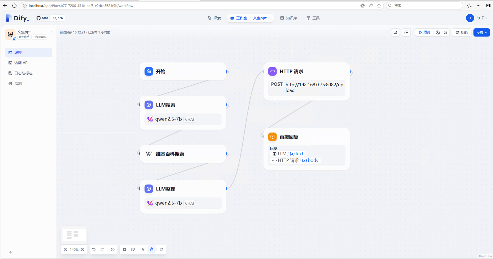

# Dify 实现文生PPT

## 概要

本文档在基于Windows平台下，使用本地部署的marpcli做Markdown转PPT，使用python Flask做本地PPT的下载服务，使用Dify作为文生PPT工作流编排框架，并使用维基百科搜索网络信息增强PPT内容，使用Xinference作为大模型运行和管理框架。本篇不做Dify和Xinference 的本地部署说明。
前置条件：确保已安装Dify、Xinference、PyCharm、Docker等并且可正常运行

## 安装marp-cli

Marp-cli官网链接：[marp-team/marp-cli: A CLI interface for Marp and Marpit based converters](https://github.com/marp-team/marp-cli)，这里不下载源码。
Marp-cli的安装采用Docker的方式，官方链接：[marpteam/marp-cli - Docker Image | Docker Hub](https://hub.docker.com/r/marpteam/marp-cli/)，这里不下载源码。

1.在本地电脑找到一个路径拉取镜像，笔者这里是`D:\marp-docker-hub`，本文后续一直会使用这个路径
2.运行powershell，执行命令：
`cd D:\marp-docker-hub [ps:读者记得替换为自己的路径]`
`docker pull marpteam/marp-cli`

3.我们这里需要的是marp-cli来给我们提供服务，所以选择如下命令行


4.执行命令：
`docker run --rm --init -v $PWD:/home/marp/app -e LANG=$LANG -p 8080:8080 -p 37717:37717 marpteam/marp-cli -s .`

这里可能会遇到如下报错


对`$PWD:/home/marp/app部分修改为"${PWD}:/home/marp/app"`，如图


完整命令：

`docker run --rm --init -v "${PWD}:/home/marp/app" -e LANG=$LANG -p 8080:8080 -p 37717:37717 marpteam/marp-cli -s . `

访问[http://localhost:8080](http://localhost:8080)，如图，可点击右侧pdf进行预览，点击pptx进行下载


至此marp-cli本地部署完成

## Python Flask创建服务

1.使用PyCharm在`D:\marp-docker-hub`下创建Python脚本
2.终端输入命令：`pip install flask`
写入代码：
```python
from flask import Flask, request
import time

app = Flask(__name__)

@app.route('/upload', methods=['POST'])
def upload_markdown():
    content = request.get_data(as_text=True)
    file_name = str(int(time.time())) + ".md"
    with open(f"data/{file_name}", 'w', encoding='utf-8') as f:
        f.write(content)
    d = f'下载链接: http://192.168.0.75:8080/data/{file_name}?pptx'
    s = f'Markdown 文件已保存\n预览链接: http://192.168.0.75:8080/data/{file_name} '
    return d + '\n' + s


if __name__ == '__main__':
app.run(host='0.0.0.0', port=8082)
```


3.使用Postman或其他http工具测试flask服务，如图正确收到了回复


4.访问`192.168.0.75:8080/data/1733387121.md`回复的内容，效果如图


至此flask服务配置完成

## 使用Dify编排文生PPT工作流
1.在Dify新建聊天助手工作流编排，节点内容如下



2.添加LLM节点，添加提示词（总结用户{{#context#}}的关键词。用于搜索引擎搜索。注意！！！你直接输出关键词！），具体配置内容如下


3.添加维基百科搜索节点，查询语句为LLM搜索的输出，语言为zh，配置如下


4.添加LLM节点，上下文为维基百科搜索的返回结果，提示词为（{{#context#}}是你获取到的知识，你需要将这些内容按照ppt的思路进行总结，最终将你总结的内容以markdown格式输出。每次生成保证每页的内容精炼，一页最多只允许5行内容，使用markdown的分页符，控制每一页的显示内容，避免内容超出边界，需要合理分页。），配置如下


5.添加HTTP节点，API选择POST并填入http://<本机ip>:8082/upload，BODY选择raw并填入LLM整理节点的返回结果，配置如下


6.添加结束节点，回复LLM整理节点和HTTP请求节点的body，配置如下


## 其他
B站链接：[实现本地化Dify+DeepSeek实现文生Word（教程）](https://www.bilibili.com/video/BV1bpKwetEz4/?spm_id_from=333.1387.upload.video_card.click&vd_source=daeee17b1bf1157a56410c7f1eebdc0f)