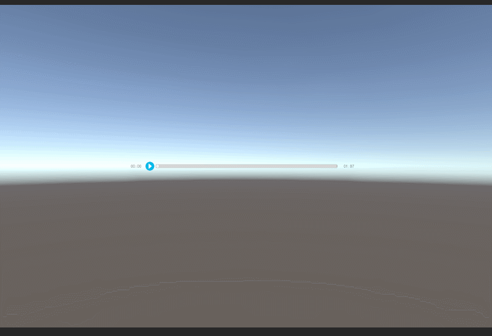
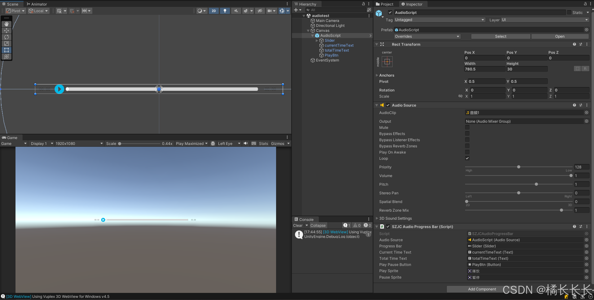

# Unity 实现可控音频进度条

## 需求分析

在Unity中实现一个可以拖拽的音频进度条，支持播放、暂停、拖拽调整进度等功能。

## 功能演示

效果如图：（因为是GIF格式，录不上音频）


## 搭建UI

1.新建空物体添加AudioSource，给AudioSource添加音频文件，取消勾选PlayOnAwake，勾选上Loop
2.创建Slider，用于控制音频进度
3.创建Button，用于控制播放和暂停
4.创建两个Text，分别为当前进度时间和总音频时间
5.准备好播放和暂停的2个UI素材


## 实现代码
```cs
using UnityEngine;
using UnityEngine.UI;
 
public class SZJCAudioProgressBar : MonoBehaviour 
{
    public AudioSource audioSource;        // 音频源
    public Slider progressBar;              // 进度条
    public Text currentTimeText;            // 当前时间文本
    public Text totalTimeText;              // 总时间文本
    public Button playPauseButton;          // 播放/暂停按钮
    public Sprite playSprite;//播放图片
    public Sprite PauseSprite;//暂停图片
 
    private bool isPlaying = false;         // 播放状态标记
 
    void Start()
    {
        // 将 Slider 的值设置为 0
        progressBar.value = 0;
 
        // 设置总时间文本
        totalTimeText.text = FormatTime(audioSource.clip.length);
 
        // 添加事件监听器
        progressBar.onValueChanged.AddListener(OnProgressBarValueChanged);
 
        // 添加按钮点击事件
        playPauseButton.onClick.AddListener(TogglePlayPause);
    }
 
    void Update()
    {
        // 更新进度条的值和当前时间文本
        if (audioSource.isPlaying)
        {
            progressBar.value = audioSource.time / audioSource.clip.length;
            currentTimeText.text = FormatTime(audioSource.time);
        }
        else if (audioSource.time >= audioSource.clip.length) // 检查是否播放完毕
        {
            // 将播放状态设置为 false
            isPlaying = false;
            playPauseButton.GetComponent<Image>().sprite = playSprite; // 更新按钮文本
            progressBar.value = 1; // 将进度条设置为满
            currentTimeText.text = FormatTime(audioSource.clip.length); // 更新当前时间文本为总时间
        }
    }
 
    // 切换播放和暂停状态
    private void TogglePlayPause()
    {
        if (isPlaying)
        {
            audioSource.Pause();
            playPauseButton.GetComponent<Image>().sprite = playSprite; // 更新按钮文本
        }
        else
        {
            audioSource.Play();
            playPauseButton.GetComponent<Image>().sprite = PauseSprite; // 更新按钮文本
        }
        isPlaying = !isPlaying; // 切换播放状态
    }
 
    // 当 Slider 的值改变时调用此方法
    private void OnProgressBarValueChanged(float value)
    {
        if (value < 1)
        {
            // 根据进度条的值设置音频播放的时间
            audioSource.time = value * audioSource.clip.length;
        }
    }
 
    // 格式化时间为 "分:秒" 格式
    private string FormatTime(float time)
    {
        int minutes = Mathf.FloorToInt(time / 60);
        int seconds = Mathf.FloorToInt(time % 60);
        return string.Format("{0:00}:{1:00}", minutes, seconds);
    }
}
```