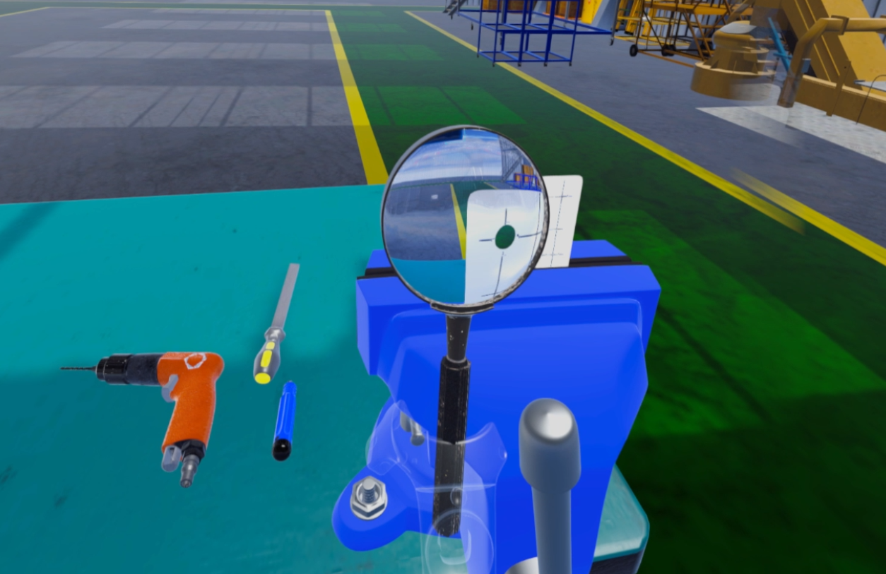

# Unity 模拟放大镜效果

## 资源下载

这个页面先以资源下载为主，后续我会再补一些实现说明和效果图。

[下载 UnityPackage](../../../blogs/downloads/Unity/放大镜.unitypackage)

## 资源说明

- 文件类型：`.unitypackage`
- 适用场景：Unity 放大镜效果演示、快速导入现成方案
- 当前内容：可直接导入工程使用

## 导入方式

1. 点击上方下载链接获取资源包
2. 打开 Unity，选择 `Assets > Import Package > Custom Package...`
3. 选择下载好的 `.unitypackage` 文件并导入

## 效果预览

