# Stable Diffusion 本地部署

## 前置条件

- 本文档在基于Windows10的本地电脑上部署StableDiffusion。
- 前置条件：确保已安装Cuda、Python3.10并且可正常运行

## 下载源码

https://github.com/AUTOMATIC1111/stable-diffusion-webui

## 修改批处理文件

1.将下载的源码包解压缩后进入路径stable-diffusion-webui-master

   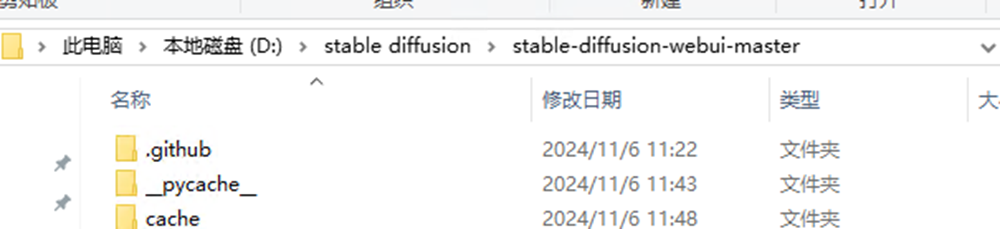

2.找到并编辑webui.bat文件

   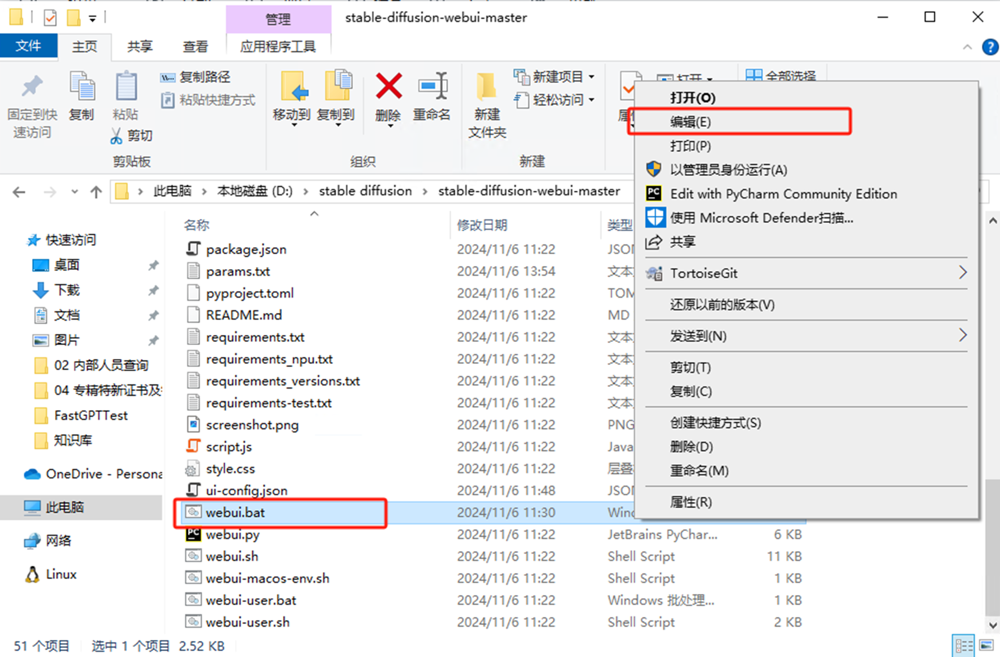

3.在文件中插入代码set COMMANDLINE_ARGS=--no-gradio-queue

   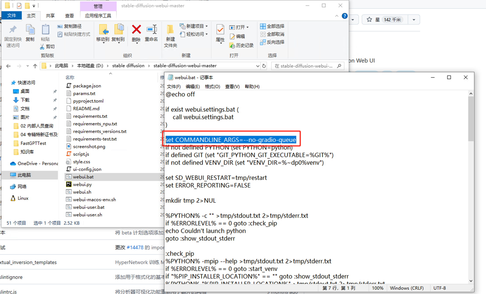

## 运行批处理文件

运行webui.bat文件，自动下载文件，下载完后自动进入到浏览器界面

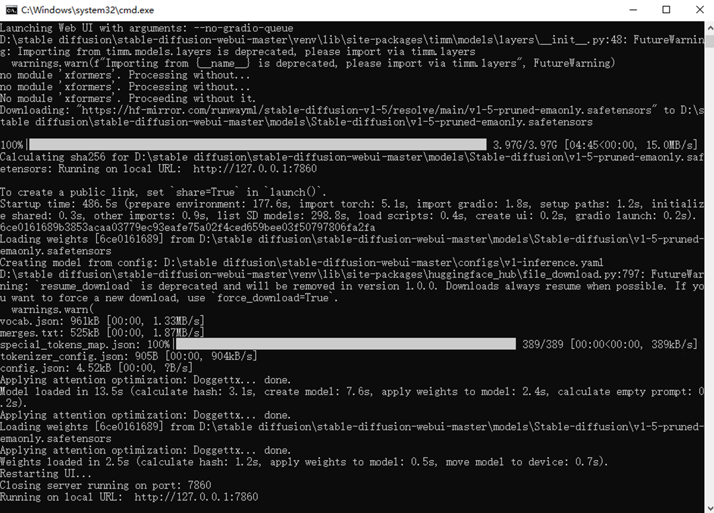

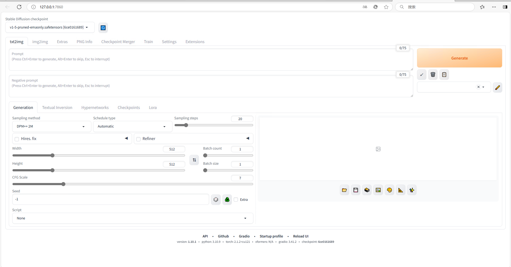

## 测试文生图

1.选择SD自带的文生图模型

   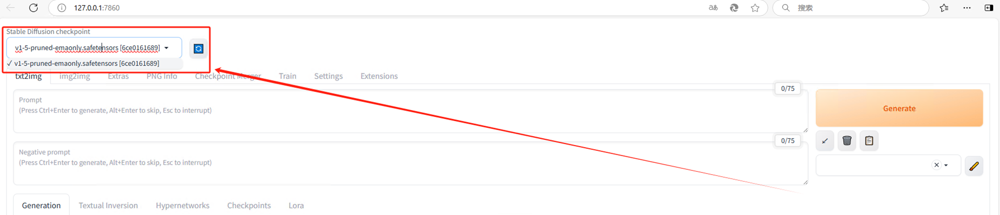

2.输入提示词，选择参数

3.点击生成按钮
   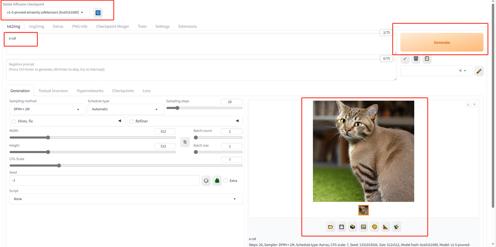

## 安装中文包

1.在webui界面选择Extensions（扩展）选项卡，选择选择Install From URL选项卡
   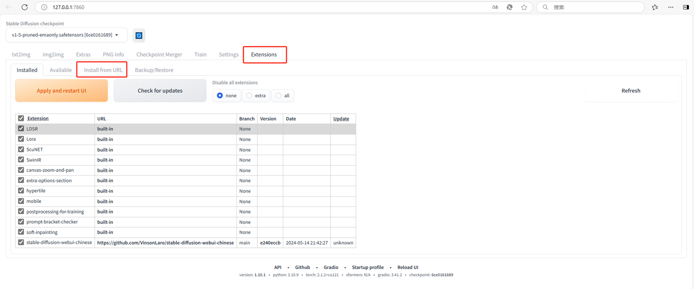
2.填入中文包地址https://github.com/VinsonLaro/stable-diffusion-webui-chinese点击Install下载
   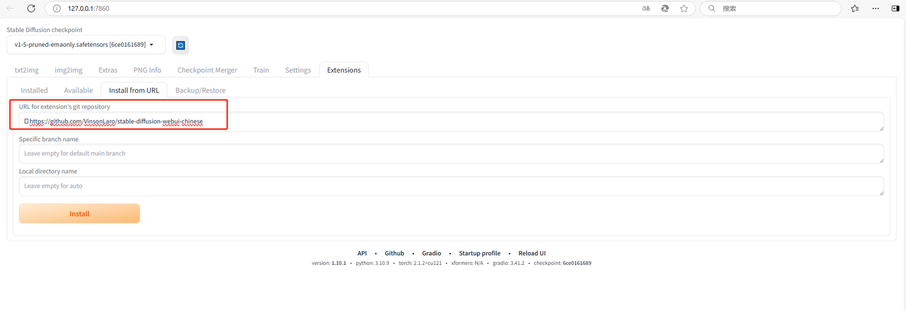
3.下载完成后选择Settings（设置）选项卡，进入User interface子选项卡，选择Chinese（中文）界面
   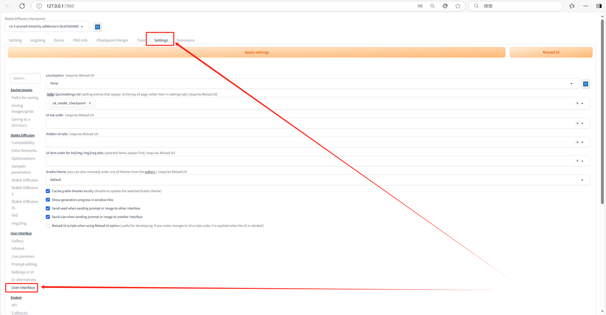
4.在Localization中选择中文包，如果没有中文包点一下右侧刷新即可
   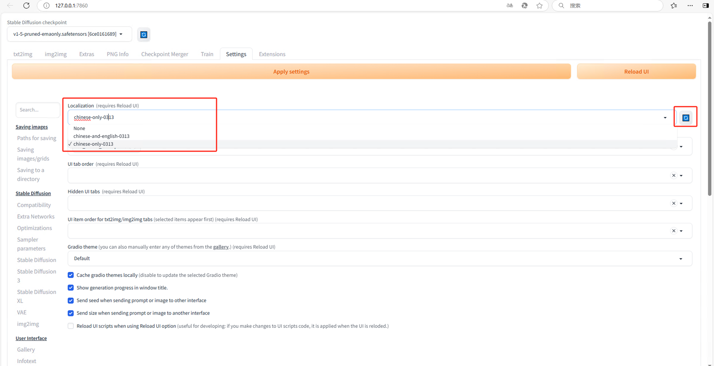
5.点击Apply settings，刷新页面，设置完成
   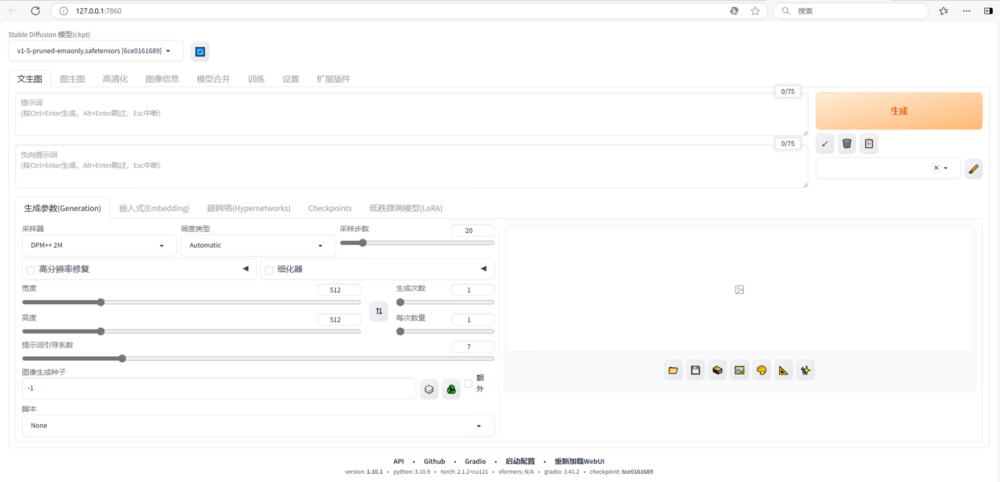