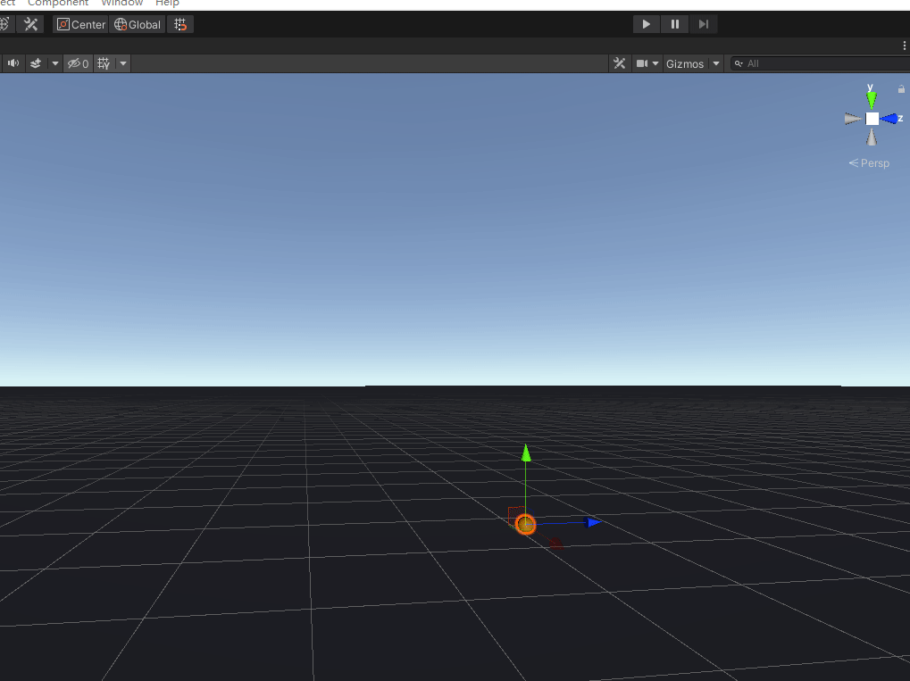

# Unity 软性管的实现

## 资源下载

这个页面当前以资源下载为主，方便直接获取工程资源并导入使用。

[下载 UnityPackage](../../../blogs/downloads/Unity/soft-tube.unitypackage)

## 资源说明

- 文件类型：`.unitypackage`
- 适用场景：软体管、软管、水管、线缆等柔性效果演示
- 使用方式：导入后可直接查看和调整

## 导入方式

1. 点击上方下载链接获取资源包
2. 打开 Unity，选择 `Assets > Import Package > Custom Package...`
3. 选择下载好的 `.unitypackage` 文件并导入
4. 导入完成后，打开对应场景或预制体查看效果

## 效果预览

